<h1 align="center">Hi, I'm Jorge Ponce 👋</h1>

  <em>Software Engineering student @ UPC (Top 10%) · Backend & Data Engineering · Automation</em>

  
  

## About me

- 🎓 Software Engineering at **UPC**, Lima — graduating **December 2026**
- 💼 Software Engineering Intern at **ARPL Tecnología Industrial** (since Dec 2024)
- 🔎 Open to **trainee / junior software engineering roles**
- 🌱 Currently going deeper into **Machine Learning & Generative AI**

## Featured work

### 🏙️ REPORTIA — UPC Capstone 2026
Citizen urban-incident reporting platform for Lima Metropolitana. Citizens report through a WhatsApp chatbot or a mobile app, and reports are offered to nearby volunteers. Team of 2 — I built the backend and the mobile app and acted as Project Manager.

- **Backend:** .NET 8 · Clean Architecture · DDD · CQRS · Transactional Outbox
- **Mobile:** React Native (Expo) · **Chatbot:** n8n + WhatsApp
- **CI/CD:** GitHub Actions (PR build validation) → Docker image → Azure Container Apps
- **Quality:** xUnit · Testcontainers (MySQL 8) · k6 load tests · OWASP ZAP · SonarQube

<!-- Replace with the real repo link(s) -->
<!-- [Backend repo](https://github.com/Thealaskage/REPO) · [Mobile repo](https://github.com/Thealaskage/REPO) -->

### 🏭 Industry work at ARPL (private code)
- **Anomaly detection app for predictive maintenance** in cement production — FastAPI endpoints for lines, equipment, sensors and maintenance indicators, Microsoft SSO; modular frontend (Feature-Driven + Atomic Design, Tailwind CSS).
- **Knowledge Management data platform** — Landing-to-Staging layers on SQL Server: 15+ tables, 12 views, 15+ stored procedures; daily ingestion orchestrated in Power Automate with Microsoft Teams failure alerts.

## Tech stack

**Backend & data**

**Frontend & mobile**

**Cloud & DevOps**

## GitHub stats

  
  

